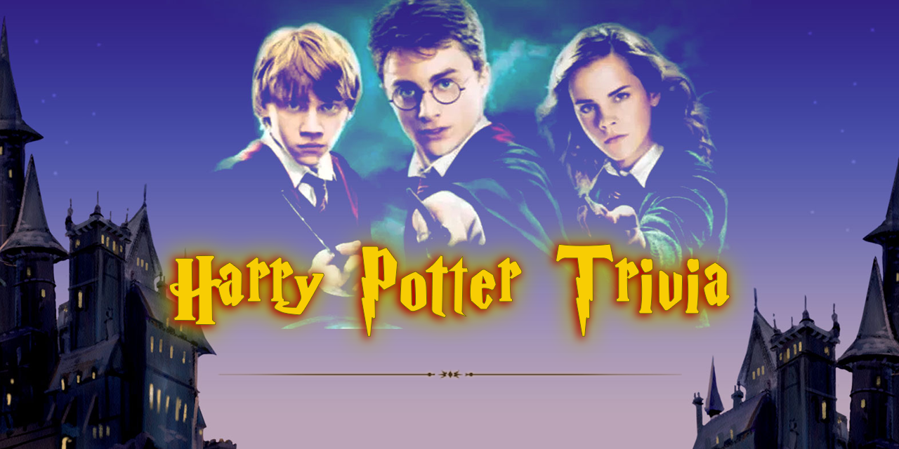

# Harry Potter TriviaGame

**How well do you know Harry Potter world?**

From spells to ghosts, potions to professors, wands to witches, discover just how much you know about the beloved wizarding world!

**Here's how the app works:**

*   You'll create a trivia game that shows only one question until the player answers it or their time runs out.
If the player selects the correct answer, show a screen congratulating them for choosing the right option. After a few seconds, display the next question -- do this without user input.

*   The scenario is similar for wrong answers and time-outs.

*   If the player runs out of time, tell the player that time's up and display the correct answer. Wait a few seconds, then show the next question.
If the player chooses the wrong answer, tell the player they selected the wrong option and then display the correct answer. Wait a few seconds, then show the next question.

*   On the final screen, show the number of correct answers, incorrect answers, and an option to restart the game (without reloading the page).

---

[Playable Demo](https://malinkamell.github.io/TriviaGame/)

**Optimized for 1920x1080 screen resolution and Google Chrome Version 77.0.3865.75**

_Made for UOA Bootcamp, September 2019_